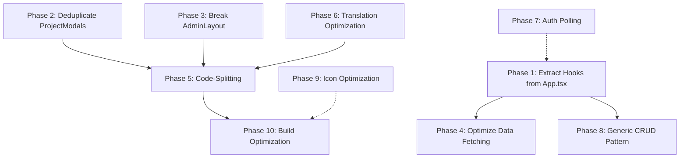

# Architecture Improvement & Performance Optimization Plan

## 📊 Progress Tracker

| Priority | Phase | Status | Completed Steps | Target Session |
| :--- | :--- | :--- | :--- | :--- |
| 🥇 1 | **Phase 7: Reduce Auth Polling Overhead** | ✅ Complete | 2 / 2 | Session 1 |
| 🥈 2 | **Phase 1: Extract Custom Hooks (God Component Decomposition)** | ✅ Complete | 10 / 10 | Session 1 & 2 |
| 🥉 3 | **Phase 4: Optimize Data Fetching (Eliminate `fetchAllData`)** | 🟢 Complete | 3 / 3 | Session 2 |
| 4 | **Phase 5: Code-Splitting & Lazy Loading** | 🟢 Complete | 5 / 5 | Session 3 |
| 5 | **Phase 2: Eliminate Code Duplication (ProjectModal ↔ ProjectViewModal)** | ✅ Complete | 6 / 6 | Session 3 & 4 |
| 6 | **Phase 3: Break Down AdminLayout Mega-Component** | ✅ Complete | 5 / 5 | Session 4 |
| 7 | **Phase 6: Translation System Optimization** | ✅ Complete | 4 / 4 | Session 5 |
| 8 | **Phase 8: Generic CRUD Pattern Extraction** | ✅ Complete | 2 / 2 | Session 5 |
| 9 | **Phase 9: MUI Icon Import Optimization** | ✅ Complete | 2 / 2 | Session 6 |
| 10 | **Phase 10: Build & Bundle Optimization** | ✅ Complete | 2 / 2 | Session 6 |

---

## 📌 How to Resume Work in Any Session
Whenever you start a new chat, simply prompt:
> *"Check [OPTIMIZATION_PLAN.md](/OPTIMIZATION_PLAN.md) and let's execute the next unchecked item."*

We will mark off completed checkboxes `[x]`, update the progress table, and run `npm run build` to verify every step before committing.

---

## Executive Summary

The EGG Project Tracker client is a **~23,000-line React + MUI + Vite** app with a **1,349 KB single-chunk JS bundle** (375 KB gzipped). The codebase has grown organically and now has significant architectural debt that impacts maintainability, developer experience, and runtime performance.

### Key Findings

| Metric | Current | Target |
|--------|---------|--------|
| Total JS bundle | 1,349 KB (375 KB gz) | ~600 KB initial + lazy chunks |
| Largest component | ProjectModal: 1,913 lines | <400 lines each |
| Code duplication | ProjectModal ↔ ProjectViewModal: ~3,700 lines combined, ~60% shared | Single shared module |
| State architecture | God component (`App.tsx`: 1,017 lines, ~30 useState calls) | Domain-separated hooks |
| API calls pattern | `fetchAllData()` → 8 parallel requests on ANY mutation | Targeted invalidation |
| Translations file | 2,299 lines, single monolith (104 KB) | Split per locale, lazy-loaded |
| Auth polling | `/api/auth/me` every 4 seconds | 30–60 seconds via WebSocket or long-poll |

---

## Phase 1: Extract Custom Hooks from App.tsx (God Component Decomposition)

> **Goal**: Break the 1,017-line `MainApp` component into domain-specific hooks, making state management testable, readable, and independently modifiable.
> 
> **Risk**: Low — Pure refactoring, no behavior changes.
> **Estimated effort**: Medium

### - [x] Step 1.1: Create `src/hooks/` directory

### - [x] Step 1.2: Extract `useProjects` hook

#### [NEW] `src/hooks/useProjects.ts`

Move from [App.tsx](file:///Users/nemanja.stanojevic/Documents/zigicode/EkosGreenGroup/project_tracker/client/src/App.tsx) lines 41, 218–326:
- `projects` state
- `handleToggleDone`, `handleMarkSampled`, `handleDeleteProject`, `handleSaveProject`
- The hook receives `authHeaders()` and `fetchAllData` as params (later we'll replace with proper invalidation)

```ts
// src/hooks/useProjects.ts
export function useProjects(authHeaders: () => Record<string, string>, fetchAllData: () => void) {
  const [projects, setProjects] = useState<Project[]>([]);
  const { t } = useLanguage();

  const handleToggleDone = useCallback((id: string) => { ... }, [projects, authHeaders, fetchAllData]);
  const handleSaveProject = useCallback(async (data: Partial<Project>): Promise<SaveResult> => { ... }, [authHeaders, fetchAllData]);
  // ... etc
  
  return { projects, setProjects, handleToggleDone, handleMarkSampled, handleDeleteProject, handleSaveProject };
}
```

### - [x] Step 1.3: Extract `useClients` hook

#### [NEW] `src/hooks/useClients.ts`

Move lines 329–381: `clients` state + `handleSaveClient`, `handleDeleteClient`

### - [x] Step 1.4: Extract `useUsers` hook

#### [NEW] `src/hooks/useUsers.ts`

Move lines 384–491: `users` state + save/delete/approve/reject/forceLogout handlers

### - [x] Step 1.5: Extract `useServices` hook

#### [NEW] `src/hooks/useServices.ts`

Move lines 494–546: `services` state + save/delete handlers

### - [x] Step 1.6: Extract `useCategories` hook

#### [NEW] `src/hooks/useCategories.ts`

Move lines 549–601: `categories` state + save/delete handlers

### - [x] Step 1.7: Extract `useReminders` hook

#### [NEW] `src/hooks/useReminders.ts`

Move lines 604–677: `reminders` state + save/delete/statusChange handlers

### - [x] Step 1.8: Extract `useInvoices` hook

#### [NEW] `src/hooks/useInvoices.ts`

Move lines 680–751: `invoices` state + save/delete/updateStatus handlers

### - [x] Step 1.9: Extract `useAppData` hook

#### [NEW] `src/hooks/useAppData.ts`

Move `fetchAllData` (lines 145–208) + `fetchPreferences`/`updatePreference` logic. This hook orchestrates all the domain hooks above.

### - [x] Step 1.10: Refactor App.tsx

#### [MODIFY] [App.tsx](file:///Users/nemanja.stanojevic/Documents/zigicode/EkosGreenGroup/project_tracker/client/src/App.tsx)

The `MainApp` component should be reduced to ~200 lines:
- Import and use all the custom hooks
- Handle only modal open/close state and routing (activeTab)
- Render the layout and pass hook-returned props to views

---

## Phase 2: Eliminate Code Duplication (ProjectModal ↔ ProjectViewModal)

> **Goal**: The two largest files in the project share ~60% of their code (imports, interfaces, sub-components like `ProjectProgressSlider`, reminder/invoice management sections). Extract shared logic and UI into reusable modules.
> 
> **Risk**: Medium — These are complex components, but changes are structural.
> **Estimated effort**: High

### - [x] Step 2.1: Extract shared `ProjectProgressSlider` component

#### [NEW] `src/components/project/ProjectProgressSlider.tsx`

Currently duplicated identically in both [ProjectModal.tsx](file:///Users/nemanja.stanojevic/Documents/zigicode/EkosGreenGroup/project_tracker/client/src/components/ProjectModal.tsx#L45-L144) and [ProjectViewModal.tsx](file:///Users/nemanja.stanojevic/Documents/zigicode/EkosGreenGroup/project_tracker/client/src/components/ProjectViewModal.tsx#L45-L146). Extract `getProgressColor()` + `ProjectProgressSlider` into a shared component file.

### - [x] Step 2.2: Extract shared `ProjectReminderSection` component

#### [NEW] `src/components/project/ProjectReminderSection.tsx`

Both modals have nearly identical reminder add/edit/list sections (~300 lines each). Extract into a single component with props to control edit vs. view behavior.

### - [x] Step 2.3: Extract shared `ProjectInvoiceSection` component

#### [NEW] `src/components/project/ProjectInvoiceSection.tsx`

Both modals have nearly identical invoice add/edit/list sections (~400 lines each). Extract into a single component.

### - [x] Step 2.4: Create `useProjectForm` hook

#### [NEW] `src/hooks/useProjectForm.ts`

Extract the ~25 `useState` calls for form fields, reminder editing state, and invoice editing state from both modals into a shared hook.

### - [x] Step 2.5: Refactor ProjectModal

#### [MODIFY] [ProjectModal.tsx](file:///Users/nemanja.stanojevic/Documents/zigicode/EkosGreenGroup/project_tracker/client/src/components/ProjectModal.tsx)

Reduce from 1,913 lines to ~400 lines by using the extracted components and hook.

### - [x] Step 2.6: Refactor ProjectViewModal

#### [MODIFY] [ProjectViewModal.tsx](file:///Users/nemanja.stanojevic/Documents/zigicode/EkosGreenGroup/project_tracker/client/src/components/ProjectViewModal.tsx)

Reduce from 1,787 lines to ~350 lines by using the extracted components and hook.

---

## Phase 3: Break Down AdminLayout Mega-Component

> **Goal**: [AdminLayout.tsx](file:///Users/nemanja.stanojevic/Documents/zigicode/EkosGreenGroup/project_tracker/client/src/components/AdminLayout.tsx) is 1,770 lines. It contains the sidebar, app bar, user profile dialog, settings dialog, password change dialog, and column configuration — all in one file.
> 
> **Risk**: Low–Medium
> **Estimated effort**: Medium

### - [x] Step 3.1: Extract `Sidebar` component

#### [NEW] `src/components/layout/Sidebar.tsx`

Move the `Drawer` / `List` / navigation items section.

### - [x] Step 3.2: Extract `AppHeader` component

#### [NEW] `src/components/layout/AppHeader.tsx`

Move the `AppBar` / `Toolbar` section with branding, search, user menu.

### - [x] Step 3.3: Extract `UserProfileDialog` component

#### [NEW] `src/components/layout/UserProfileDialog.tsx`

Move the profile view/edit dialog with avatar, password change.

### - [x] Step 3.4: Extract `SettingsDialog` component

#### [NEW] `src/components/layout/SettingsDialog.tsx`

Move the app settings/preferences dialog.

### - [x] Step 3.5: Refactor AdminLayout

#### [MODIFY] [AdminLayout.tsx](file:///Users/nemanja.stanojevic/Documents/zigicode/EkosGreenGroup/project_tracker/client/src/components/AdminLayout.tsx)

Should reduce to ~300 lines — just composition of the extracted sub-components.

---

## Phase 4: Optimize Data Fetching (Eliminate `fetchAllData` Anti-Pattern) 🟢 Complete

> **Goal**: Currently, EVERY mutation (save, delete, toggle, status change) calls `fetchAllData()` which fires **8 parallel API requests**. This means saving a single reminder triggers re-fetching all projects, clients, users, services, categories, reminders, invoices, and stats.
> 
> **Risk**: Medium — Requires careful testing that data stays in sync.
> **Estimated effort**: Medium–High

### - [x] Step 4.1: Create individual fetch functions

#### [NEW] `src/hooks/useAppData.ts` (extend from Phase 1)

```ts
const fetchProjects = useCallback(async () => { ... }, [authHeaders, searchQuery]);
const fetchClients = useCallback(async () => { ... }, [authHeaders]);
const fetchUsers = useCallback(async () => { ... }, [authHeaders]);
const fetchServices = useCallback(async () => { ... }, [authHeaders]);
const fetchCategories = useCallback(async () => { ... }, [authHeaders]);
const fetchReminders = useCallback(async () => { ... }, [authHeaders]);
const fetchInvoices = useCallback(async () => { ... }, [authHeaders]);
const fetchStats = useCallback(async () => { ... }, [authHeaders]);
```

### - [x] Step 4.2: Wire each mutation to targeted re-fetch

For each domain hook, after a successful mutation, only re-fetch the relevant data:

| Mutation | Current | Optimized |
|----------|---------|-----------|
| Save project | fetchAllData (8 reqs) | fetchProjects + fetchStats |
| Delete client | fetchAllData (8 reqs) | fetchClients + fetchStats |
| Save reminder | fetchAllData (8 reqs) | fetchReminders + fetchStats |
| Toggle done | fetchAllData (8 reqs) | fetchProjects + fetchStats |
| Approve user | fetchAllData (8 reqs) | fetchUsers |

### - [x] Step 4.3: Optimistic updates for common mutations

For toggle done, progress change, and status changes — update local state immediately and only roll back on server error.

---

## Phase 5: Code-Splitting & Lazy Loading 🟢 Complete

> **Goal**: The production bundle is a **single 1,349 KB chunk**. Split by route/view to reduce initial load to ~600 KB.
> 
> **Risk**: Low
> **Estimated effort**: Low–Medium

### - [x] Step 5.1: Lazy load view components

#### [MODIFY] [App.tsx](file:///Users/nemanja.stanojevic/Documents/zigicode/EkosGreenGroup/project_tracker/client/src/App.tsx)

```tsx
const DashboardView = React.lazy(() => import('./components/views/DashboardView'));
const ProjectsView = React.lazy(() => import('./components/views/ProjectsView'));
const ClientsView = React.lazy(() => import('./components/views/ClientsView'));
const UsersView = React.lazy(() => import('./components/views/UsersView'));
const ServicesView = React.lazy(() => import('./components/views/ServicesView'));
const CategoriesView = React.lazy(() => import('./components/views/CategoriesView'));
const RemindersView = React.lazy(() => import('./components/views/RemindersView'));
const InvoicesView = React.lazy(() => import('./components/views/InvoicesView'));
```

Wrap each in `<Suspense fallback={<CircularProgress />}>`.

### - [x] Step 5.2: Lazy load modals

#### [MODIFY] [App.tsx](file:///Users/nemanja.stanojevic/Documents/zigicode/EkosGreenGroup/project_tracker/client/src/App.tsx)

```tsx
const ProjectModal = React.lazy(() => import('./components/ProjectModal'));
const ProjectViewModal = React.lazy(() => import('./components/ProjectViewModal'));
```

These are the two largest components (88 KB + 82 KB source). They should only be loaded when a user opens a modal.

### - [x] Step 5.3: Lazy load `StatisticsCharts` (includes @mui/x-charts)

#### [MODIFY] [DashboardView.tsx](file:///Users/nemanja.stanojevic/Documents/zigicode/EkosGreenGroup/project_tracker/client/src/components/views/DashboardView.tsx)

```tsx
const StatisticsCharts = React.lazy(() => import('../StatisticsCharts'));
```

`@mui/x-charts` is a heavy dependency; only load when user navigates to statistics sub-tab.

### - [x] Step 5.4: Configure Vite manual chunks

#### [MODIFY] [vite.config.ts](file:///Users/nemanja.stanojevic/Documents/zigicode/EkosGreenGroup/project_tracker/client/vite.config.ts)

```ts
build: {
  rollupOptions: {
    output: {
      manualChunks: {
        'vendor-mui': ['@mui/material', '@emotion/react', '@emotion/styled'],
        'vendor-mui-icons': ['@mui/icons-material'],
        'vendor-mui-charts': ['@mui/x-charts'],
        'vendor-react': ['react', 'react-dom'],
      },
    },
  },
},
```

### - [x] Step 5.5: Convert view components to default exports

Each view component currently uses named exports (`export const DashboardView`). For `React.lazy()` to work, they need default exports. Add `export default DashboardView` at the bottom of each view file, or refactor to use `export default`.

---

## Phase 6: Translation System Optimization 🟢 Complete

> **Goal**: The [translations.ts](file:///Users/nemanja.stanojevic/Documents/zigicode/EkosGreenGroup/project_tracker/client/src/i18n/translations.ts) file is **2,299 lines / 104 KB** — all 3 languages in a single file loaded at startup.
> 
> **Risk**: Low
> **Estimated effort**: Medium

### - [x] Step 6.1: Split translations into per-language files

#### [NEW] `src/i18n/locales/en.ts`
#### [NEW] `src/i18n/locales/sr-Latn.ts`
#### [NEW] `src/i18n/locales/sr-Cyrl.ts`

Each file exports a `TranslationKeys` object for that language.

### - [x] Step 6.2: Create a translation loader

#### [NEW] `src/i18n/loader.ts`

```ts
export async function loadTranslation(lang: Language): Promise<TranslationKeys> {
  switch (lang) {
    case 'en': return (await import('./locales/en')).default;
    case 'sr-Latn': return (await import('./locales/sr-Latn')).default;
    case 'sr-Cyrl': return (await import('./locales/sr-Cyrl')).default;
  }
}
```

### - [x] Step 6.3: Update LanguageContext to lazy-load

#### [MODIFY] [LanguageContext.tsx](file:///Users/nemanja.stanojevic/Documents/zigicode/EkosGreenGroup/project_tracker/client/src/context/LanguageContext.tsx)

Load only the active language on startup. Pre-load fallback language in background. Keep the `TranslationKeys` type in the original file for type-checking.

### - [x] Step 6.4: Keep type definitions in translations.ts

#### [MODIFY] [translations.ts](file:///Users/nemanja.stanojevic/Documents/zigicode/EkosGreenGroup/project_tracker/client/src/i18n/translations.ts)

Reduce to just the type definitions (`TranslationKeys`, `Language`, `serviceTypeTranslations`, `errorMessageTranslations`). The actual translation dictionaries move to locale files.

---

## Phase 7: Reduce Auth Polling Overhead

> **Goal**: [AuthContext.tsx](file:///Users/nemanja.stanojevic/Documents/zigicode/EkosGreenGroup/project_tracker/client/src/context/AuthContext.tsx) polls `/api/auth/me` every **4 seconds** (line 120). This generates ~900 requests/hour per active tab.
> 
> **Risk**: Low
> **Estimated effort**: Low

### - [x] Step 7.1: Increase polling interval

#### [MODIFY] [AuthContext.tsx](file:///Users/nemanja.stanojevic/Documents/zigicode/EkosGreenGroup/project_tracker/client/src/context/AuthContext.tsx#L120)

Change from 4,000ms to 30,000ms (30 seconds). A blocked user waiting 30s is acceptable.

### - [x] Step 7.2: Add visibility-based polling

Only poll when the browser tab is active:

```ts
useEffect(() => {
  if (!currentUser) return;
  let interval: ReturnType<typeof setInterval>;

  const startPolling = () => {
    interval = setInterval(checkAuth, 30000);
  };
  const stopPolling = () => clearInterval(interval);

  const handleVisibility = () => {
    if (document.hidden) stopPolling();
    else { checkAuth(); startPolling(); }
  };

  document.addEventListener('visibilitychange', handleVisibility);
  startPolling();
  return () => { stopPolling(); document.removeEventListener('visibilitychange', handleVisibility); };
}, [currentUser]);
```

---

## Phase 8: Generic CRUD Pattern Extraction 🟢 Complete

> **Goal**: There are ~6 nearly identical save/delete handler patterns in `App.tsx` and ~6 nearly identical table view components with sort/filter/column-select logic. Create a generic pattern to eliminate boilerplate.
> 
> **Risk**: Low–Medium
> **Estimated effort**: Medium

### - [x] Step 8.1: Create `useCrudOperations` generic hook

#### [NEW] `src/hooks/useCrudOperations.ts`

```ts
interface CrudConfig<T> {
  basePath: string;
  entityName: string;
  onSuccess?: () => void;
}

export function useCrudOperations<T extends { id: string }>(config: CrudConfig<T>) {
  const save = async (data: Partial<T>): Promise<SaveResult> => { ... };
  const remove = async (id: string) => { ... };
  return { save, remove };
}
```

### - [x] Step 8.2: Refactor each domain hook to use `useCrudOperations`

Reduce each of the 6 domain hooks from ~50-70 lines to ~15-20 lines.

---

## Phase 9: MUI Icon Import Optimization 🟢 Complete

> **Goal**: MUI icons are imported individually across many files (e.g., `import DeleteIcon from '@mui/icons-material/Delete'`). While Vite tree-shakes well, the sheer number of unique icons across 20+ files creates many small modules.
> 
> **Risk**: Low
> **Estimated effort**: Low

### - [x] Step 9.1: Audit and deduplicate icon imports

Run a scan to identify all icons used across the app and create a centralized barrel export.

#### [NEW] `src/components/icons.ts`

```ts
export { default as DeleteIcon } from '@mui/icons-material/Delete';
export { default as SaveIcon } from '@mui/icons-material/Save';
// ... all used icons
```

### - [x] Step 9.2: Update all component imports

Replace per-file icon imports with imports from the centralized `icons.ts` file.

---

## Phase 10: Build & Bundle Optimization 🟢 Complete

> **Goal**: Fine-tune Vite build config for better caching, smaller chunks, and faster loads.
> 
> **Risk**: Low
> **Estimated effort**: Low

### - [x] Step 10.1: Add content-hash-based caching

#### [MODIFY] [vite.config.ts](file:///Users/nemanja.stanojevic/Documents/zigicode/EkosGreenGroup/project_tracker/client/vite.config.ts)

```ts
build: {
  sourcemap: false,
  cssCodeSplit: true,
  rollupOptions: {
    output: {
      chunkFileNames: 'assets/[name]-[hash].js',
      entryFileNames: 'assets/[name]-[hash].js',
      assetFileNames: 'assets/[name]-[hash][extname]',
    },
  },
},
```

### - [x] Step 10.2: Add bundle analysis

```bash
npm install --save-dev rollup-plugin-visualizer
```

#### [MODIFY] [vite.config.ts](file:///Users/nemanja.stanojevic/Documents/zigicode/EkosGreenGroup/project_tracker/client/vite.config.ts)

Add visualizer plugin for production analysis.

---

## Execution Order & Dependencies



> **Phases 1, 2, 3, 6, 7, 9 can all be started independently** (no inter-dependencies).
> 
> **Phase 4** depends on Phase 1 (hooks need to exist before wiring targeted fetches).
> 
> **Phase 5** should come after Phases 2 & 3 (components need to be broken down before lazy-loading makes sense).
> 
> **Phase 10** is final polish, depends on Phase 5.

---

## Recommended Execution Priority

Given limited Claude Opus tokens, execute in this order for **maximum impact per session**:

| Priority | Phase | Impact | Effort | Rationale |
|----------|-------|--------|--------|-----------|
| 🥇 1 | **Phase 7: Auth Polling** | High perf | Very Low | 5 min fix, massive request reduction |
| 🥈 2 | **Phase 1: Extract Hooks** | Architecture | Medium | Foundational — everything else depends on clean state management |
| 🥉 3 | **Phase 4: Data Fetching** | High perf | Medium | ~85% reduction in API calls per mutation |
| 4 | **Phase 5: Code-Splitting** | High perf | Low–Med | Halves initial bundle size |
| 5 | **Phase 2: Deduplicate Modals** | Maintainability | High | Eliminates ~2,000 lines of duplication |
| 6 | **Phase 3: Break AdminLayout** | Maintainability | Medium | Major readability improvement |
| 7 | **Phase 6: Translation Split** | Bundle size | Medium | Saves ~70 KB from initial load |
| 8 | **Phase 8: Generic CRUD** | DX | Medium | Polish, reduces boilerplate |
| 9 | **Phase 9: Icon Optimization** | Bundle/DX | Low | Minor cleanup |
| 10 | **Phase 10: Build Config** | Performance | Low | Final polish |

---

## Verification Plan

### After Each Phase

1. **Build check**: `npm run build` must succeed with no TypeScript errors
2. **Bundle size**: Record and compare via Vite build output
3. **Visual regression**: Manually verify each view (dashboard, projects, clients, etc.) looks the same
4. **Functional test**: Test CRUD operations for each entity
5. **Auth flow**: Test login/logout/session expiry

### Final Verification

- Total bundle size should be **<700 KB initial** (currently 1,349 KB)
- No single component file should exceed **500 lines**
- API calls per mutation should be **1-2** (currently 8)
- Auth polling should be **30s** with visibility gating (currently 4s, always on)

---

## Session Planning

> [!TIP]
> **Each phase is designed to be independently committable**. If your Claude Opus tokens run out mid-phase, you can commit what's done and continue in the next session. The steps within each phase are ordered so that partial completion is still useful.

> [!IMPORTANT]
> **When starting a new session**, reference this plan and say "Continue with Phase X, Step Y" to pick up exactly where you left off. All file paths, line numbers, and patterns are documented above for easy resumption.
