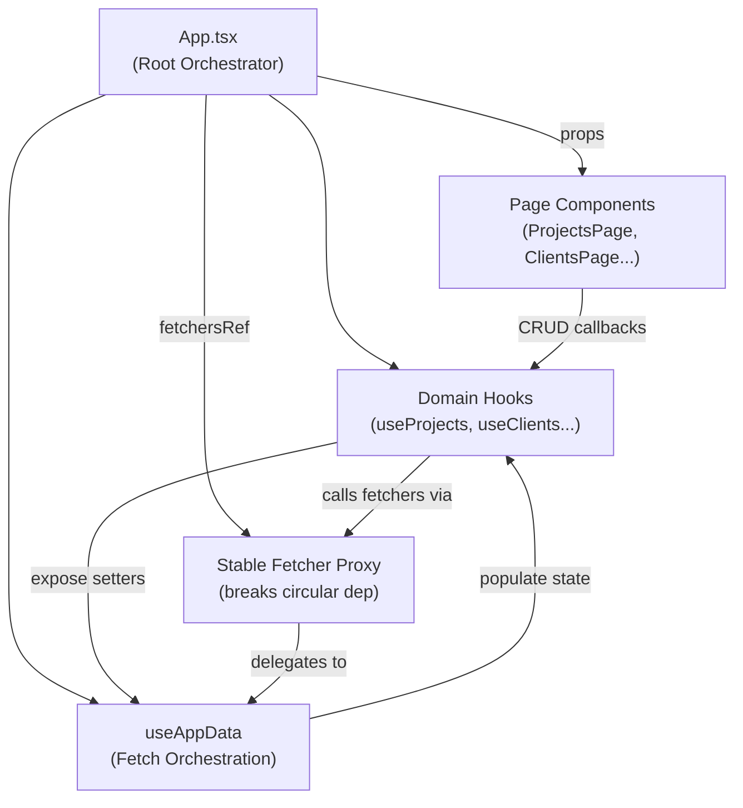
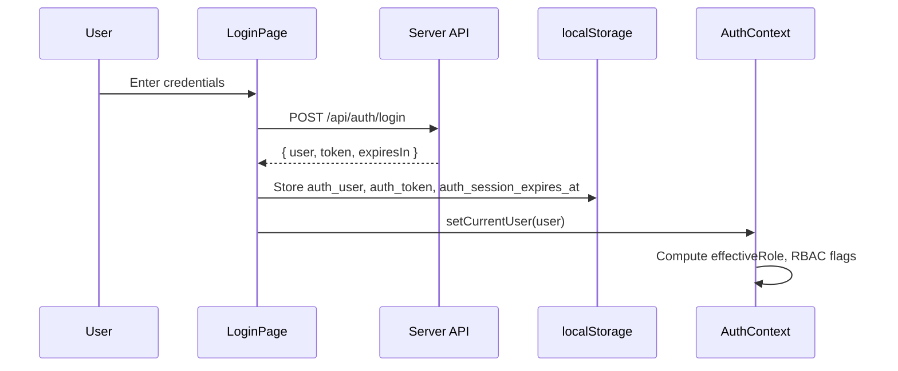
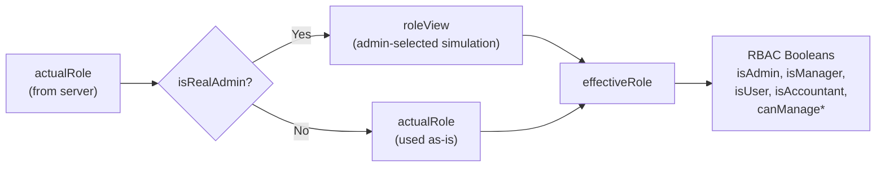
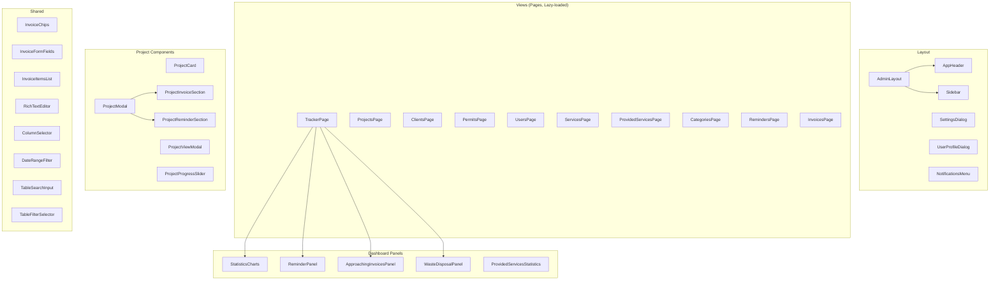
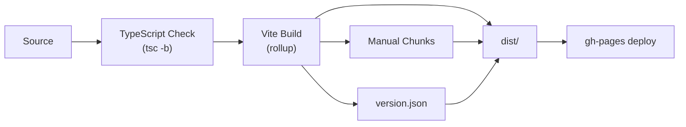

# Client Architecture — Ekos Project Tracker

> Comprehensive architecture reference for the client-side SPA.

---

## 1. Technology Stack

| Layer | Technology | Version |
|---|---|---|
| **Runtime** | React | 19.2.x |
| **Language** | TypeScript | 6.0.x |
| **Build Tool** | Vite | 8.2.x |
| **UI Framework** | Material UI (MUI) | 9.3.x |
| **CSS-in-JS** | Emotion | 11.14.x |
| **Charts** | MUI X Charts | 9.11.x |
| **Linting** | oxlint | 1.75.x |
| **Deployment** | GitHub Pages (gh-pages) | 6.3.x |

**No router library** is used — navigation is driven by local `activeTab` state.

---

## 2. Application Bootstrap

```
index.html
  └── src/main.tsx
        ├── StrictMode
        └── <App />
              ├── LanguageProvider        (i18n)
              │   └── AuthProvider        (auth + RBAC)
              │       └── NotificationProvider (notifications)
              │           └── CustomThemeProvider (MUI theme)
              │               └── <MainApp />   (the actual app)
              └── vite:preloadError handler (auto-reload on chunk miss)
```

### Provider Nesting Order (outermost → innermost)
1. **`LanguageProvider`** — i18n must be available to all other providers
2. **`AuthProvider`** — auth state consumed by notifications and layout
3. **`NotificationProvider`** — depends on `useAuth()` for user context
4. **`CustomThemeProvider`** — MUI theme, depends on user preferences

---

## 3. Application Architecture

### 3.1 `MainApp` — The Root Orchestrator

[`App.tsx`](file:///Users/nemanja.stanojevic/Documents/zigicode/EkosGreenGroup/project_tracker/client/src/App.tsx) is the central orchestrator (~640 lines) that:
- Composes all domain hooks (`useProjects`, `useClients`, etc.)
- Manages global UI state (active tab, modals, confirm dialogs)
- Wires data fetching via `useAppData`
- Renders the active view via conditional blocks (no router)
- Handles project modal lifecycle (create/edit/view)

### 3.2 Data Flow



**Key pattern — `fetchersRef`:** Domain hooks need to call `fetchProjects()`, `fetchStats()`, etc. after mutations. But those functions come from `useAppData`, which needs the domain hooks' setters. The `fetchersRef` (a `useRef`) is a stable proxy object created once via `useMemo`, whose methods always delegate to the current ref value. This cleanly breaks the circular dependency.

### 3.3 State Management

No external state library — the app uses React's built-in primitives:

| Mechanism | Usage |
|---|---|
| `useState` | All domain data, UI state, form state |
| `useContext` | Auth, Language, Theme, Notifications (4 contexts) |
| `useRef` | `fetchersRef` (circular dep breaker), dedup guards |
| `useMemo` | Derived stats, stable objects, expensive computations |
| `useCallback` | All event handlers and API functions |
| `localStorage` | Auth session, theme preference, language, admin role view |

### 3.4 View Routing

Navigation uses a discriminated `ActiveTab` union type:

```typescript
type ActiveTab = 'dashboard' | 'projects' | 'clients' | 'permits' |
                 'users' | 'services' | 'providedServices' |
                 'categories' | 'reminders' | 'invoices';
```

Views are **lazy-loaded** via `React.lazy()` + `<Suspense>`:
```typescript
const TrackerPage = React.lazy(() => import('./pages/tracker/TrackerPage'));
```

Sub-tabs exist for:
- **Dashboard**: `'projects' | 'reminders' | 'invoices' | 'waste-disposal' | 'waste-management' | 'statistic'`
- **Provided Services**: `'summary' | 'statistics'`

---

## 4. Authentication & Authorization

### 4.1 Auth Flow



### 4.2 Role-Based Access Control (RBAC)



| Role | Dashboard | Projects | Clients | Permits | Users | Services | ProvidedServices | Categories | Reminders | Invoices |
|---|---|---|---|---|---|---|---|---|---|---|
| **Administrator** | ✅ | ✅ | ✅ | ✅ | ✅ | ✅ | ✅ | ✅ | ✅ | ✅ |
| **Manager** | ✅ | ✅ | ✅ | ✅ | ✅ | ✅ | ✅ | ✅ | ✅ | ✅ |
| **Manager (User View)** | ✅ | — | — | — | — | — | — | — | — | — |
| **Accountant** | ✅ (invoice-focused) | — | — | — | — | — | — | — | — | — |
| **User** | ✅ (personal) | — | — | — | — | — | — | — | — | — |

**Manager "Work on Entities" toggle:** Managers can switch between full Manager mode (manage all entities) and a User-like view (only personal dashboard). Controlled via `workOnEntities` flag, persisted in localStorage and server preferences.

### 4.3 Session Management

- **JWT stored** in `localStorage` as `auth_token`
- **Session expiry** tracked client-side via `auth_session_expires_at` (timestamp)
- **Periodic auth check** every 30s via `GET /api/auth/me` — logs out blocked users
- **Session expiry check** every 15s — compares `Date.now()` against stored expiry
- **Page Visibility API** — all polling pauses when tab is hidden, resumes + immediate check on tab focus
- **`auth:expired` custom event** — dispatched by `apiFetch()` on 401, triggers global logout

---

## 5. Internationalization (i18n)

### Architecture

```
src/i18n/
├── translations.ts    ← Type definitions + shared maps
├── loader.ts          ← Dynamic import() based lazy loading
└── locales/
    ├── en.ts          ← English (~27KB)
    ├── sr-Latn.ts     ← Serbian Latin (~28KB) — DEFAULT
    └── sr-Cyrl.ts     ← Serbian Cyrillic (~38KB)
```

### Translation System

| Feature | Implementation |
|---|---|
| **Key lookup** | `t('key')` → string from active dictionary |
| **Interpolation** | `t('key', { count: 5 })` → replaces `{count}` in template |
| **Service labels** | `getServiceLabel(typeCode, services?)` → translated service name |
| **Gender-aware labels** | `getResponsibleLabel(userOrGender, usersList?)` → `Odgovoran/Odgovorna/Odgovorno` |
| **Error translation** | `getErrorMessage(rawError)` → localized error message |
| **Lazy loading** | Locale dictionaries loaded via dynamic `import()` — only active locale is bundled |

### Adding a Translation Key

1. Add the key to the `TranslationKeys` interface in [`translations.ts`](file:///Users/nemanja.stanojevic/Documents/zigicode/EkosGreenGroup/project_tracker/client/src/i18n/translations.ts)
2. Add values in all 3 locale files (`en.ts`, `sr-Latn.ts`, `sr-Cyrl.ts`)
3. Use via `const { t } = useLanguage(); t('myNewKey');`

---

## 6. Theming

### Theme System

The app uses a custom MUI theme defined in [`theme.ts`](file:///Users/nemanja.stanojevic/Documents/zigicode/EkosGreenGroup/project_tracker/client/src/theme/theme.ts):

| Aspect | Light Mode | Dark Mode |
|---|---|---|
| **Primary** | `#2e7d32` (Forest Green) | `#4caf50` (Green) |
| **Secondary** | `#16a34a` | `#34d399` (Emerald) |
| **Background** | `#f4f6f8` / `#ffffff` | `#0b130e` / `#132018` |
| **Text** | `#1b2c22` / `#516758` | `#f0f7f2` / `#9ec1a3` |

**Custom palette extension — `status`:**
| Status | Light | Dark | Used For |
|---|---|---|---|
| `active` | `#2e7d32` | `#4caf50` | Active projects |
| `done` | `#16a34a` | `#34d399` | Completed projects |
| `stale` | `#ed6c02` | `#fb923c` | Stale projects |
| `sampled` | `#9c27b0` | `#c084fc` | Recently sampled |

**Theme modes:** `light`, `dark`, `system` (auto-detects via `prefers-color-scheme`).

**Typography:** Inter font family, no text-transform on buttons, custom heading weights.

**Global overrides:** Scroll lock disabled on all overlays (Modal, Popover, Menu, Select, Dialog, Drawer) to prevent body scroll issues.

---

## 7. Component Architecture

### 7.1 Layout Shell

```
<AdminLayout>
  ├── <AppHeader />           — Top bar, user menu, notifications
  ├── <Sidebar />             — Navigation, sub-tabs, version
  ├── <main>                  — Active view content
  ├── <UserProfileDialog />   — Profile editor
  ├── <SettingsDialog />      — App settings
  └── <CompanyInfoModal />    — Company details
```

### 7.2 Component Categories



### 7.3 Table View Pattern

All 11 table-based views/panels follow this architecture:

```typescript
function MyPage(props: ViewProps & TableViewProps) {
  // 1. Table infrastructure
  const tableView = useTableView({
    defaultColumns: ['col1', 'col2'],
    visibleColumns: props.visibleColumns,
    onVisibleColumnsChange: props.onVisibleColumnsChange,
    defaultRowsPerPage: 25,
    rowsPerPageProp: props.rowsPerPage,
    onRowsPerPageChange: props.onRowsPerPageChange,
    defaultSortField: 'name',
    sortState: props.sortState,
    onSortChange: props.onSortChange,
    onRefresh: props.onRefresh,
  });

  // 2. CRUD operations
  const { handleSave, handleDelete } = useCrudOperations({
    basePath: '/api/my-entity',
    items, authHeaders, onSuccess, onDeleteConfirm,
    deleteConfirmMessageKey: 'confirmDelete',
    errorSaveMessageKey: 'errorSaving',
  });

  // 3. Render table with sorted/paginated data
  return <MuiTable>...</MuiTable>;
}
```

---

## 8. API Communication

### 8.1 API Client

All HTTP requests go through [`apiFetch()`](file:///Users/nemanja.stanojevic/Documents/zigicode/EkosGreenGroup/project_tracker/client/src/api.ts):

```
apiFetch(path, init?)
  ├── Resolves full URL via VITE_API_BASE_URL
  ├── Auto-attaches Authorization: Bearer <token>
  ├── Auto-attaches X-User-Id header
  ├── Calls native fetch()
  └── On 401 → dispatches 'auth:expired' event → auto logout
```

### 8.2 API Endpoints Consumed

| Endpoint | Methods | Used By |
|---|---|---|
| `/api/auth/login` | POST | AuthContext |
| `/api/auth/register` | POST | AuthContext |
| `/api/auth/me` | GET | AuthContext (polling) |
| `/api/projects` | GET, POST | useAppData, useProjects |
| `/api/projects/:id` | PUT, DELETE | useProjects (via useCrudOperations) |
| `/api/projects/:id/toggle-done` | PATCH | useProjects |
| `/api/projects/:id/sample` | PATCH | useProjects |
| `/api/projects/stats` | GET | useAppData |
| `/api/clients` | GET, POST | useAppData, useClients |
| `/api/clients/:id` | PUT, DELETE | useClients |
| `/api/users` | GET, POST | useAppData, useUsers |
| `/api/users/:id` | PUT, DELETE | useUsers |
| `/api/users/:id/approve` | PATCH | useUsers |
| `/api/users/:id/reject` | PATCH | useUsers |
| `/api/users/:id/force-logout` | POST | useUsers |
| `/api/services` | GET, POST | useAppData, useServices |
| `/api/services/:id` | PUT, DELETE | useServices |
| `/api/provided-services` | GET, POST | useAppData, useProvidedServices |
| `/api/provided-services/:id` | PUT, DELETE | useProvidedServices |
| `/api/categories` | GET, POST | useAppData, useCategories |
| `/api/categories/:id` | PUT, DELETE | useCategories |
| `/api/reminders` | GET, POST | useAppData, useReminders |
| `/api/reminders/:id` | PUT, DELETE | useReminders |
| `/api/reminders/:id/status` | PATCH | useReminders (via useStatusUpdate) |
| `/api/invoices` | GET, POST | useAppData, useInvoices |
| `/api/invoices/:id` | PUT, DELETE | useInvoices |
| `/api/invoices/:id/status` | PATCH | useInvoices (via useStatusUpdate) |
| `/api/permits` | GET, POST | useAppData, usePermits |
| `/api/permits/:id` | PUT, DELETE | usePermits |
| `/api/waste-catalog` | GET | useAppData |
| `/api/notifications` | GET | NotificationContext |
| `/api/notifications/:id/read` | PATCH | NotificationContext |
| `/api/notifications/mark-all-read` | PATCH | NotificationContext |
| `/api/notifications/:id` | DELETE | NotificationContext |
| `/api/notifications/clear-all` | DELETE | NotificationContext |
| `/api/company-info` | GET, PUT | CompanyInfoModal |
| `/api/preferences` | GET | useAppData |
| `/api/preferences/:key` | PUT | useAppData |

### 8.3 Dev Server Proxy

```typescript
// vite.config.ts
server: {
  port: 3000,
  proxy: {
    "/api": {
      target: "http://localhost:5000",
      changeOrigin: true,
    },
  },
},
```

---

## 9. Build & Deployment

### 9.1 Build Pipeline



### 9.2 Chunk Strategy

| Chunk Name | Contents | Rationale |
|---|---|---|
| `vendor-react` | react, react-dom | Rarely changes, long cache |
| `vendor-mui` | @mui/material, @emotion/* | Large, stable |
| `vendor-mui-icons` | @mui/icons-material | Tree-shaken via barrel file |
| `vendor-mui-charts` | @mui/x-charts | Only used in dashboard analytics |
| Per-view chunks | Each lazy-loaded view | Code-split per route |

### 9.3 Version System

Build-time globals injected via Vite `define`:
- `__APP_VERSION__` — from git tag → package.json → `1.0.0`
- `__COMMIT_HASH__` — `git rev-parse --short HEAD`
- `__BUILD_TIME__` — ISO timestamp

Runtime `version.json` emitted to `dist/` — polled by `useVersionCheck` hook to detect new deployments and show an update banner.

### 9.4 CI/CD

Automated via GitHub Actions on PR merge to `main`:
1. Determine version bump from PR labels/title (conventional commits)
2. Bump `package.json` version
3. Update `CHANGELOG.md`
4. Create git tag + GitHub Release
5. Trigger deploy to GitHub Pages

---

## 10. Directory Structure

```
client/
├── docs/                          # Documentation (you are here)
│   ├── AI_CONTEXT.md              # AI quick reference
│   └── ARCHITECTURE.md            # This file
├── public/                        # Static assets
├── src/
│   ├── api.ts                     # API client (apiFetch)
│   ├── types.ts                   # All TypeScript types
│   ├── main.tsx                   # Entry point
│   ├── App.tsx                    # Root orchestrator
│   ├── App.css                    # Component styles
│   ├── index.css                  # Global styles + CSS variables
│   ├── assets/                    # SVG logos
│   │   ├── logo.svg
│   │   └── favicon.svg
│   ├── context/                   # React context providers
│   │   ├── AuthContext.tsx         # Auth + RBAC
│   │   ├── LanguageContext.tsx     # i18n
│   │   ├── ThemeContext.tsx        # MUI theming
│   │   └── NotificationContext.tsx # @mention notifications
│   ├── hooks/                     # Custom React hooks
│   │   ├── useAppData.ts          # Data fetching orchestration
│   │   ├── useCrudOperations.ts   # Generic CRUD factory
│   │   ├── useTableView.ts        # Shared table infrastructure
│   │   ├── useProjects.ts         # Project state + operations
│   │   ├── useClients.ts          # Client state + CRUD
│   │   ├── useUsers.ts            # User state + admin ops
│   │   ├── useServices.ts         # Service state + CRUD
│   │   ├── useProvidedServices.ts # Provided service state + CRUD
│   │   ├── useCategories.ts       # Category state + CRUD
│   │   ├── useReminders.ts        # Reminder state + CRUD
│   │   ├── useInvoices.ts         # Invoice state + CRUD
│   │   ├── usePermits.ts          # Permit + waste catalog
│   │   ├── useProjectForm.ts      # Project form state
│   │   ├── useInvoiceFormState.ts  # Invoice form state
│   │   ├── useStatusUpdate.ts     # Generic status PATCH
│   │   ├── useVersionCheck.ts     # Deployment update detection
│   │   └── useRoleLabels.ts       # Role translation
│   ├── i18n/                      # Internationalization
│   │   ├── translations.ts        # Types + shared maps
│   │   ├── loader.ts              # Lazy locale loading
│   │   └── locales/
│   │       ├── en.ts
│   │       ├── sr-Latn.ts         # Default
│   │       └── sr-Cyrl.ts
│   ├── theme/
│   │   └── theme.ts               # MUI theme config
│   ├── utils/
│   │   └── invoiceUtils.ts        # Invoice note metadata
│   ├── components/                # Modular UI components
│   │   ├── icons.ts               # MUI icon barrel (~90 icons)
│   │   ├── common/
│   │   │   ├── ColumnSelector.tsx
│   │   │   ├── DateRangeFilter.tsx
│   │   │   ├── LanguageSelector.tsx
│   │   │   ├── RichTextEditor.tsx
│   │   │   ├── TableFilterSelector.tsx
│   │   │   └── TableSearchInput.tsx
│   │   ├── dialogs/
│   │   │   ├── CompanyInfoModal.tsx
│   │   │   ├── ConfirmDeleteDialog.tsx
│   │   │   ├── ConfirmDialog.tsx
│   │   │   ├── CustomDataModelModal.tsx
│   │   │   ├── ErrorDialog.tsx
│   │   │   └── VersionUpdatePrompt.tsx
│   │   ├── invoice/
│   │   │   ├── InvoiceChips.tsx
│   │   │   ├── InvoiceFormFields.tsx
│   │   │   └── InvoiceItemsList.tsx
│   │   ├── layout/
│   │   │   ├── AdminLayout.tsx
│   │   │   ├── AppHeader.tsx
│   │   │   ├── NotificationsMenu.tsx
│   │   │   ├── SettingsDialog.tsx
│   │   │   ├── Sidebar.tsx
│   │   │   └── UserProfileDialog.tsx
│   │   ├── project/
│   │   │   ├── ProjectCard.tsx
│   │   │   ├── ProjectInvoiceSection.tsx
│   │   │   ├── ProjectModal.tsx
│   │   │   ├── ProjectProgressSlider.tsx
│   │   │   ├── ProjectReminderSection.tsx
│   │   │   └── ProjectViewModal.tsx
│   │   ├── providedService/
│   │   │   └── ProvidedServiceInvoiceSection.tsx
│   │   └── tracker/
│   │       ├── ApproachingInvoicesPanel.tsx
│   │       ├── DashboardPanelSkeleton.tsx
│   │       ├── ProvidedServicesStatistics.tsx
│   │       ├── ReminderPanel.tsx
│   │       ├── StatisticsCharts.tsx
│   │       └── WasteDisposalPanel.tsx
│   ├── pages/                     # Full page views
│   │   ├── auth/
│   │   │   └── LoginPage.tsx
│   │   ├── management/
│   │   │   ├── CategoriesPage.tsx
│   │   │   ├── ClientsPage.tsx
│   │   │   ├── InvoicesPage.tsx
│   │   │   ├── PermitsPage.tsx
│   │   │   ├── ProjectsPage.tsx
│   │   │   ├── ProvidedServicesPage.tsx
│   │   │   ├── RemindersPage.tsx
│   │   │   ├── ServicesPage.tsx
│   │   │   └── UsersPage.tsx
│   │   └── tracker/
│   │       └── TrackerPage.tsx
│   ├── package.json
│   ├── tsconfig.json
│   ├── tsconfig.app.json
│   ├── tsconfig.node.json
│   ├── vite.config.ts
│   ├── .oxlintrc.json
│   ├── CHANGELOG.md
│   ├── README.md
│   ├── SECURITY.md
│   └── VERSIONING.md
```
